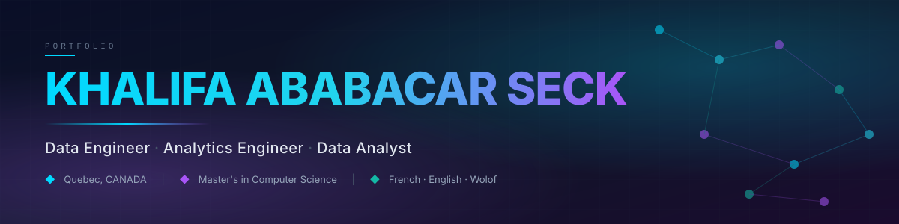
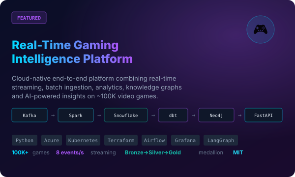
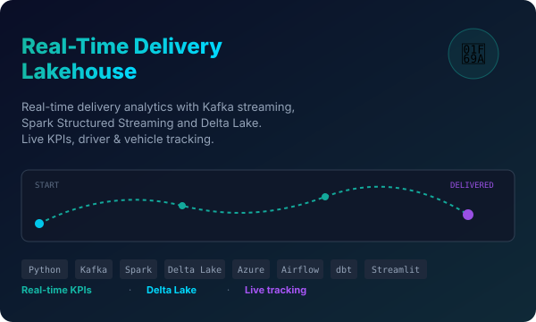
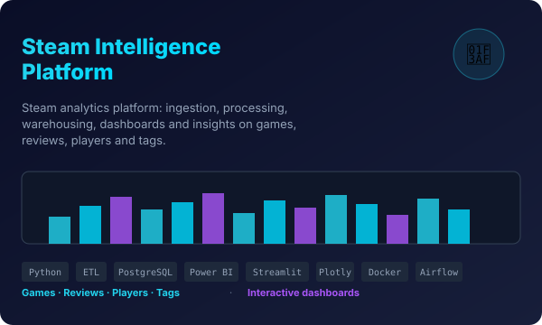
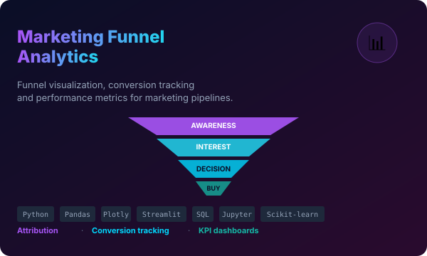
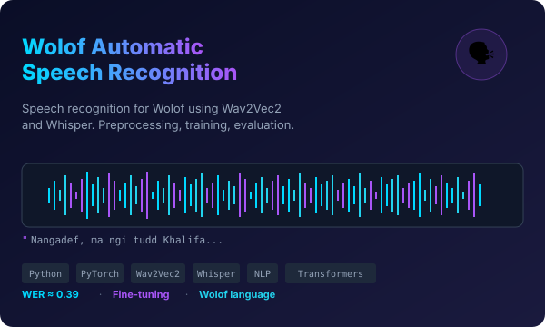
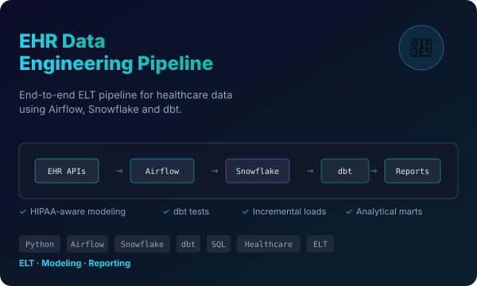
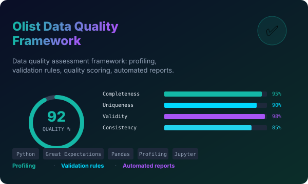
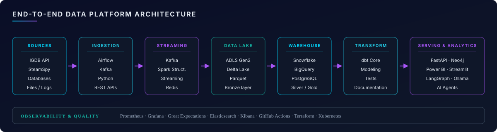

<!-- ============================================================ -->
<!--    KHALIFA ABABACAR SECK  ·  GitHub Profile README            -->
<!-- ============================================================ -->

<p align="center">
  
</p>

<p align="center">
  <a href="https://github.com/KhalifaSeck"></a>
  <a href="https://www.linkedin.com/in/khalifa-ababacar-seck-a1632a1a7/"></a>
  <a href="mailto:seckhalifaa@gmail.com"></a>
  
</p>

<p align="center">
  
  
</p>


## 01 · About Me

Hi, I'm **Khalifa Ababacar Seck**, a Computer Science graduate specializing in **Data Engineering**, **Analytics Engineering** and **Data Analysis**. Originally from **Senegal**, I moved to **Quebec, Canada** to pursue a Master's in Computer Science at the **University of Sherbrooke**, focusing on data engineering, data science and information systems.

My journey with data started in Senegal, where I earned a Bachelor's and a Master's in **Statistics and Decision-Making Informatics** at the University Alioune Diop of Bambey, before deepening my skills in modern data platforms and cloud infrastructure in Canada. I love the whole life-cycle of data designing **ingestion pipelines**, building **real-time streaming architectures**, modeling with **dbt** on warehouses like **Snowflake**, and shipping **AI-powered analytics** and dashboards that people actually use.

Collaboration and clear communication are at the core of how I work. I'm fluent in **French**, **English** and **Wolof**, a language I even taught to a speech-recognition model in one of my recent projects and I thrive in multicultural, cross-functional environments.

Outside of data pipelines and cloud diagrams, I enjoy exploring new technologies, contributing to open-source, and turning complex problems into elegant systems. Thanks for visiting my portfolio feel free to explore my projects or reach out. **I'd love to connect and talk about data, AI, or the next challenge worth building.**

```yaml
name:       Khalifa Ababacar Seck
role:       Data Engineer · Analytics Engineer · Data Analyst
education:  Master's in Computer Science — University of Sherbrooke (2025 – 08/2026)
languages:  French · English · Wolof
location:   Quebec, CANADA  (originally from Senegal)
focus:      Modern data platforms · Real-time streaming · AI-powered analytics
```


## 02 · Technical Skills

### 🛠️ Data Engineering & Automation


### ☁️ Cloud & Data Platforms


### 🗄️ Databases & Modeling


`Relational & dimensional modeling`  ·  `SQL optimization`  ·  `Data governance`  ·  `Performance tuning`

### 📊 Data Analytics & Business Intelligence


`KPIs`  ·  `Statistical analysis`  ·  `Tabular & geospatial data`  ·  `Data storytelling`

### 🧠 AI, Machine Learning & Agentic AI


`LLMs`  ·  `Agent orchestration`  ·  `Tool integration`  ·  `AI workflow automation`

### 🧑‍💻 Software Development & Collaboration


### 🔎 Observability & Data Quality


`Pipeline monitoring`  ·  `Anomaly detection`  ·  `Data validation`  ·  `Quality scoring`

### 🤝 Methods & Collaboration


`Requirements analysis`  ·  `Technical documentation`  ·  `Communication`  ·  `Problem solving`


## 03 · Featured Projects

<table>
<tr>
<td width="50%" valign="top">
<a href="https://github.com/KhalifaSeck/realtime-gaming-platform">
  
</a>
<h3>🎮 <a href="https://github.com/KhalifaSeck/realtime-gaming-platform">realtime-gaming-platform</a></h3>
<p>Cloud-native end-to-end data platform combining real-time streaming, batch ingestion, analytics, knowledge graphs and AI on ~100K video games.</p>
<p>


</p>
</td>
<td width="50%" valign="top">
<a href="https://github.com/KhalifaSeck/realtime-delivery-lakehouse">
  
</a>
<h3>🚚 <a href="https://github.com/KhalifaSeck/realtime-delivery-lakehouse">realtime-delivery-lakehouse</a></h3>
<p>Real-time delivery analytics platform using Kafka, Spark Structured Streaming and Delta Lake. Live KPIs, driver &amp; vehicle tracking, historical analytics.</p>
<p>


</p>
</td>
</tr>

<tr>
<td width="50%" valign="top">
<a href="https://github.com/KhalifaSeck/Steam-Intelligence-Platform">
  
</a>
<h3>🎯 <a href="https://github.com/KhalifaSeck/Steam-Intelligence-Platform">Steam-Intelligence-Platform</a></h3>
<p>Steam data analytics platform with data collection, processing pipelines, analytical warehouse, dashboards and insights on games, reviews, players and tags.</p>
<p>


</p>
</td>
<td width="50%" valign="top">
<a href="https://github.com/KhalifaSeck/marketing-funnel">
  
</a>
<h3>📊 <a href="https://github.com/KhalifaSeck/marketing-funnel">marketing-funnel</a></h3>
<p>Marketing funnel analysis project with data pipelines, funnel visualization, conversion tracking and performance metrics.</p>
<p>


</p>
</td>
</tr>

<tr>
<td width="50%" valign="top">
<a href="https://github.com/KhalifaSeck/asr-wolof-speech-recognition">
  
</a>
<h3>🗣️ <a href="https://github.com/KhalifaSeck/asr-wolof-speech-recognition">asr-wolof-speech-recognition</a></h3>
<p>Automatic Speech Recognition for Wolof using Wav2Vec2 and Whisper models. Preprocessing, training, evaluation and inference — WER ≈ 0.39.</p>
<p>


</p>
</td>
<td width="50%" valign="top">
<a href="https://github.com/KhalifaSeck/EHR-Practice-Fusion-Data-Pipeline">
  
</a>
<h3>🏥 <a href="https://github.com/KhalifaSeck/EHR-Practice-Fusion-Data-Pipeline">EHR-Practice-Fusion-Data-Pipeline</a></h3>
<p>End-to-end ELT pipeline for healthcare data using Airflow, Snowflake and dbt. Ingestion, transformation, data modeling and analytical reporting.</p>
<p>


</p>
</td>
</tr>

<tr>
<td width="50%" valign="top">
<a href="https://github.com/KhalifaSeck/olist-data-quality">
  
</a>
<h3>✅ <a href="https://github.com/KhalifaSeck/olist-data-quality">olist-data-quality</a></h3>
<p>Data quality assessment framework for Olist dataset — profiling, validation rules, data quality scoring and automated reports.</p>
<p>


</p>
</td>
<td width="50%" valign="top">
<h3>🧭 More projects</h3>
<ul>
<li><a href="https://github.com/KhalifaSeck/videogames-analytics-platform"><b>videogames-analytics-platform</b></a> — video games analytics dashboards for business intelligence.</li>
<li><a href="https://github.com/KhalifaSeck/Fullstack-Data-Engineering-Project"><b>Fullstack-Data-Engineering-Project</b></a> — Docker · PostgreSQL · Terraform · dbt · Airflow.</li>
<li><a href="https://github.com/KhalifaSeck/openfoodfacts-pipeline"><b>openfoodfacts-pipeline</b></a> — Python · API · ETL pipeline over OpenFoodFacts.</li>
<li><a href="https://github.com/KhalifaSeck/IMPLEMENTATION-FROM-SCRATCH-DES-KNN-VOISINS"><b>knn-from-scratch</b></a> — KNN algorithm implemented from scratch in Python.</li>
</ul>
<p>➡ <a href="https://github.com/KhalifaSeck?tab=repositories">See all repositories</a></p>
</td>
</tr>
</table>


## 04 · End-to-End Data Platform Architecture

<p align="center">
  
</p>


## 05 · GitHub Stats

<p align="center">
  
  
</p>

<p align="center">
  
  
</p>

<p align="center">
  
</p>

<!-- Snake contribution animation (activated via .github/workflows/snake.yml) -->
<p align="center">
  
</p>


## 06 · Education

<table>
<tr>
<td width="70px" align="center" valign="top">🎓</td>
<td valign="top">
<b>Master's Degree — Computer Science</b><br/>
<i>University of Sherbrooke</i>  ·  Sherbrooke, Canada  ·  <code>2025 – 08/2026</code><br/>
Focus: Data Engineering  ·  Information Systems  ·  Data Science
</td>
</tr>
<tr>
<td width="70px" align="center" valign="top">🎓</td>
<td valign="top">
<b>Master's Degree — Statistics &amp; Decision-Making Informatics</b><br/>
<i>University Alioune Diop of Bambey</i>  ·  Diourbel, Senegal  ·  <code>2021 – 2023</code><br/>
Focus: Statistical modeling  ·  Business intelligence  ·  Data-driven decision systems
</td>
</tr>
<tr>
<td width="70px" align="center" valign="top">🎓</td>
<td valign="top">
<b>Bachelor's Degree — Statistics &amp; Decision-Making Informatics</b><br/>
<i>University Alioune Diop of Bambey</i>  ·  Diourbel, Senegal  ·  <code>2018 – 2020</code><br/>
Focus: Mathematics  ·  Statistics  ·  Programming fundamentals
</td>
</tr>
</table>


## 07 · Currently Building

- ⚡ Real-time data pipelines at scale
- ☁️ Cloud-native data platforms on Azure & GCP
- 🧠 AI-powered analytics applications (LangGraph · Ollama · smolagents)
- 🕸️ Knowledge graphs with Neo4j
- 📊 Data quality & observability frameworks


## 08 · Let's Connect

<p>Interested in <b>data engineering</b>, <b>analytics</b> or <b>AI</b>? Let's talk.</p>

<p>
  <a href="https://www.linkedin.com/in/khalifa-ababacar-seck-a1632a1a7/"></a>
  <a href="mailto:seckhalifaa@gmail.com"></a>
  <a href="https://github.com/KhalifaSeck"></a>
</p>

<blockquote>
  <i>"Turning data into insights. Building systems that make an impact."</i>
</blockquote>

<p align="center">
  <sub>⚡ Crafted with attention to detail  ·  Last updated 2026</sub>
</p>
